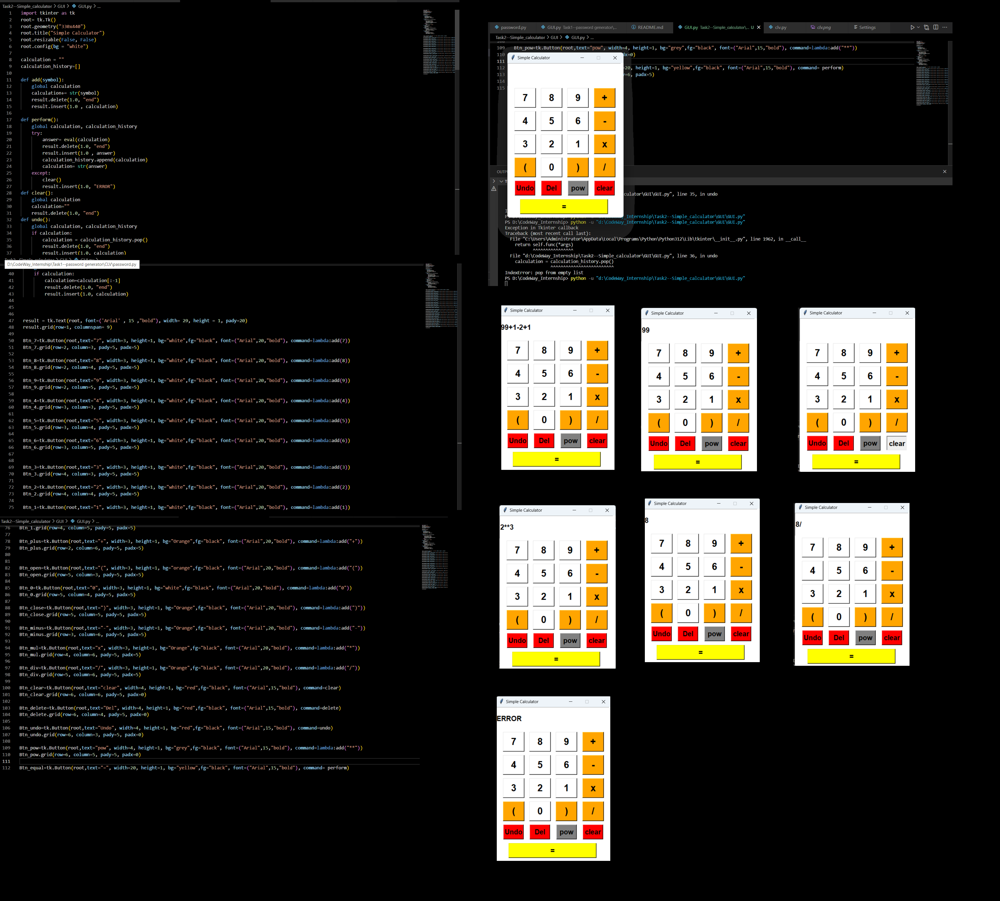

> "Success is not the key to happiness. Happiness is the key to success. If you love what you are doing, you will be successful." - Albert Schweitzer

# Task 2: Simple Calculator

## Description

Design a simple calculator with basic arithmetic operations. Prompt the user to input two numbers and an operation choice. Perform the calculation and display the result.

- ### A Simple Calculator
  This project provides a simple calculator application implemented in Python. It offers both a command-line interface (CLI) version and a graphical user interface (GUI) version. Users can input two numbers and choose an arithmetic operation, and the calculator will display the result.

## Features

- **Basic Arithmetic Operations:** Addition, subtraction, multiplication, and division.
- **User Input:** Prompt the user to input two numbers and select an operation.
- **CLI and GUI:** Choose between a command-line interface or a user-friendly graphical interface.
- **Error Handling:** Handle invalid inputs gracefully.
- **Responsive Design:** GUI version offers an adjustable window size for better user experience.

## Command-Line Interface (CLI) Version

### How to Use

1. Clone the Repository:
    ```bash
    git clone https://github.com/Poorani-27/CodeWay.git
    cd simple-calculator/cli
    ```

2. Run the Script:
    ```bash
    python calculator_cli.py
    ```
    - Follow the on-screen instructions to input two numbers and select an operation.

3. Exit the Calculator:
    - Type 'q', 'quit', or 'end' to exit the calculator.

## Graphical User Interface (GUI) Version

### How to Use

1. Clone the Repository:
    ```bash
    git clone https://github.com/Poorani-27/CodeWay.git
    cd simple-calculator/gui
    ```

2. Run the GUI App:
    ```bash
    python calculator_gui.py
    ```
    - Use the buttons to input numbers and select operations.

3. Perform Calculation:
    - Click the '=' button to perform the calculation.
    - View the result displayed on the screen.

4. Close the GUI:
    - Close the window to exit the calculator.

Happy calculating!

#### Graphical User Interface



#### Command-Line Version


