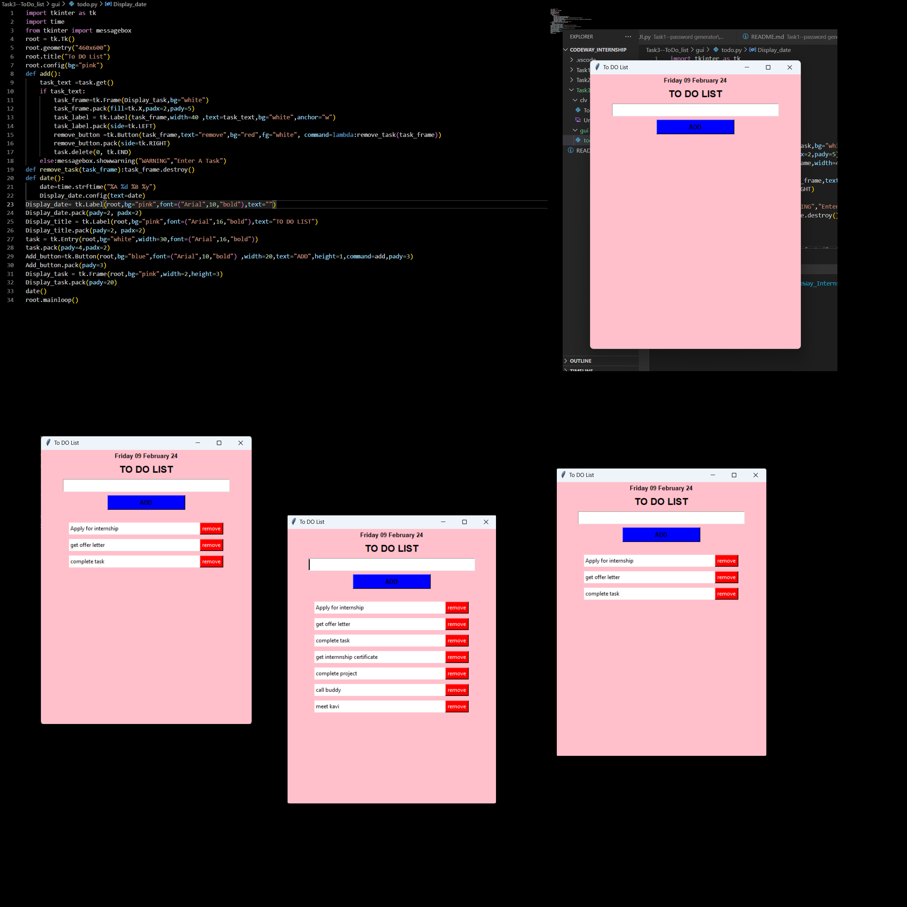
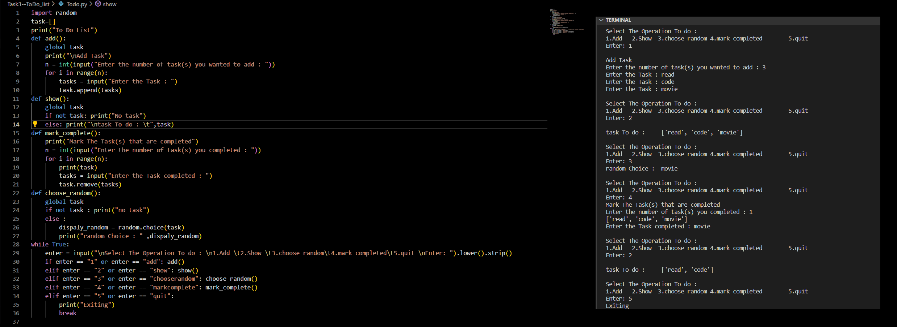

# To Do List

## Description

This project implements a To Do List application using Python. It provides both a graphical user interface (GUI) version using the Tkinter library and a command-line interface (CLI) version. Users can add tasks, mark tasks as completed, view tasks, and choose a random task to work on.

## Graphical User Interface (GUI) Version

### Features

- **Task Addition:** Users can add tasks through the GUI by typing them into the entry field and clicking the "ADD" button.
- **Task Display:** Added tasks are displayed with a "remove" button for each task for easy management.
- **Task Removal:** Tasks can be removed individually by clicking the "remove" button.
- **Date Display:** The application displays the current date.
  

## Command-Line Interface (CLI) Version

### Features

- **Task Addition:** Users can add tasks via the command line by entering the number of tasks to add and providing task descriptions.
- **Task Display:** Users can view the list of tasks added.
- **Task Removal:** Users can mark tasks as completed, removing them from the list.
- **Random Task Selection:** Users can choose a random task from the list.
- **Quit Option:** Users can exit the application.

#### How to Run

1. Open a terminal.
2. Navigate to the directory containing the CLI script.
3. Run the script using the command:
    ```
    python clv_todo.py
    ```
### GUI

