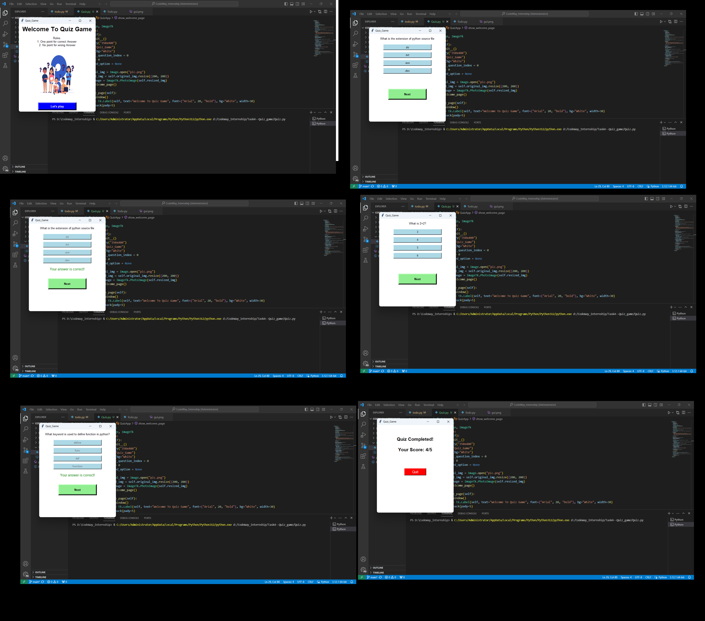

# Quiz Game

## Description

This project implements a quiz game that asks users multiple-choice or fill-in-the-blank questions on a specific topic. The game keeps track of scores, provides feedback on correct/incorrect answers, and offers a variety of questions to make it challenging and engaging.
1.Develop a quiz game that asks users multiple-choice or fill-in-the-blank questions on a specific topic. 
2.The game should keep track of scores, provide feedback on correct/incorrect answers, and offer a variety of questions to make it challenging and
engaging.
3.Load Quiz Questions. Calculate the Final Score. Display Final Results: Display Welcome Message and Rules.
4.Present Quiz Questions: Display each question and answer choice. Prompt the user to select an answer.
5.Evaluate the User's Answer: Compare the user's answer with the correct answer. Keep track of the user's score.
6.Provide Feedback: Display if the answer was correct or incorrect. Show the correct answer for incorrect responses.
7.Play Again: Ask the user if they want to play again.

## Graphical User Interface (GUI) Version

### Features

- **Load Quiz Questions:** The game loads a set of quiz questions from a predefined database.
- **Calculate Final Score:** At the end of the quiz, the game calculates the final score based on the number of correct answers.
- **Display Final Results:** After completing the quiz, the game displays a final message along with the user's score.
- **Present Quiz Questions:** Each question is displayed along with answer choices for the user to select from.
- **Evaluate User's Answer:** The game compares the user's answer with the correct answer and keeps track of the user's score.
- **Provide Feedback:** Feedback is provided to the user after each question, indicating whether the answer was correct or incorrect. The correct answer is shown for incorrect responses.
- **Play Again:** Users have the option to play the quiz again after completing it.

#### How to Run

1. Make sure you have Python installed on your system.
2. Download the provided Python script (`quiz.py`) to your local machine.
3. Open a terminal or command prompt.
4. Navigate to the directory where the script is saved.
5. Run the script using the following command:
    ```
    python quiz.py
    ```

### GUI


