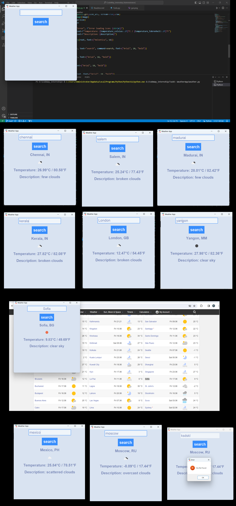

# Task 5: Weather API Integration

## Description

This task involves integrating a weather API into the existing Tkinter-based Weather App. The goal is to enhance the application by fetching real-time weather data for a specified city and displaying it to the user.

## Features

- **Weather Data Retrieval:** Utilize a weather API (e.g., OpenWeatherMap API) to fetch weather data based on the user's input city.
- **Error Handling:** Implement error handling to gracefully manage scenarios such as invalid API key, city not found, and internal server errors.
- **Display Weather Information:** Show relevant weather information including temperature (in both Celsius and Fahrenheit), weather description, city name, and country code.
- **Display Weather Icon:** Retrieve and display the weather icon corresponding to the current weather conditions.

## Implementation Details

- **API Key:** Replace the placeholder `"your api key"` with your actual API key obtained from the weather service provider (e.g., OpenWeatherMap).
- **API Request:** Construct API requests using the city name provided by the user and the API key.
- **Response Handling:** Process the API response, extracting relevant weather information such as temperature, weather description, and icon ID.
- **Error Handling:** Implement logic to handle different HTTP status codes and error scenarios returned by the API.
- **Display:** Update the Tkinter GUI to dynamically display the retrieved weather information and icon.

## How to Run

1. Ensure you have a valid API key from the weather service provider.
2. Replace the placeholder `"your api key"` in the code with your actual API key.
3. Run the Tkinter-based Weather App script.
4. Enter the desired city in the input field and click the "Search" button.
5. View the weather information displayed on the GUI, including temperature, weather description, city name, country code, and weather icon.

## Future Enhancements

- **Unit Selection:** Allow users to switch between Celsius and Fahrenheit units for temperature display.
- **Forecast Display:** Implement functionality to retrieve and display weather forecasts for multiple days.
- **Location Auto-detection:** Add support for automatically detecting the user's location based on IP address or GPS coordinates.

